# Aikyum ✨

### Nerfed Version of Aikyum. Limited to Blogging.

[](https://www.repostatus.org/#active)
[](https://unrmedia.framer.media/)

---
## Preview
This is where we can showcase the current codebase visually.

##### Blog Homepage and Blog Detail Page
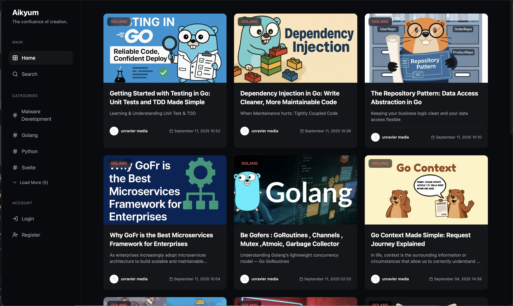
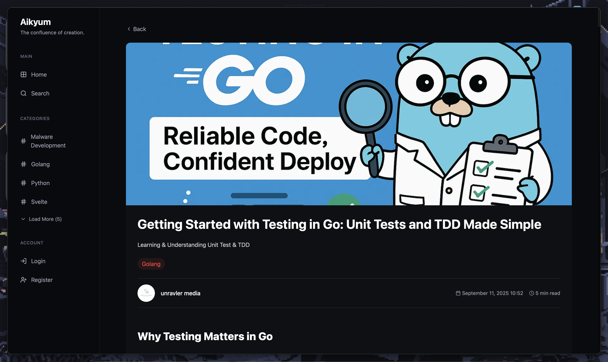
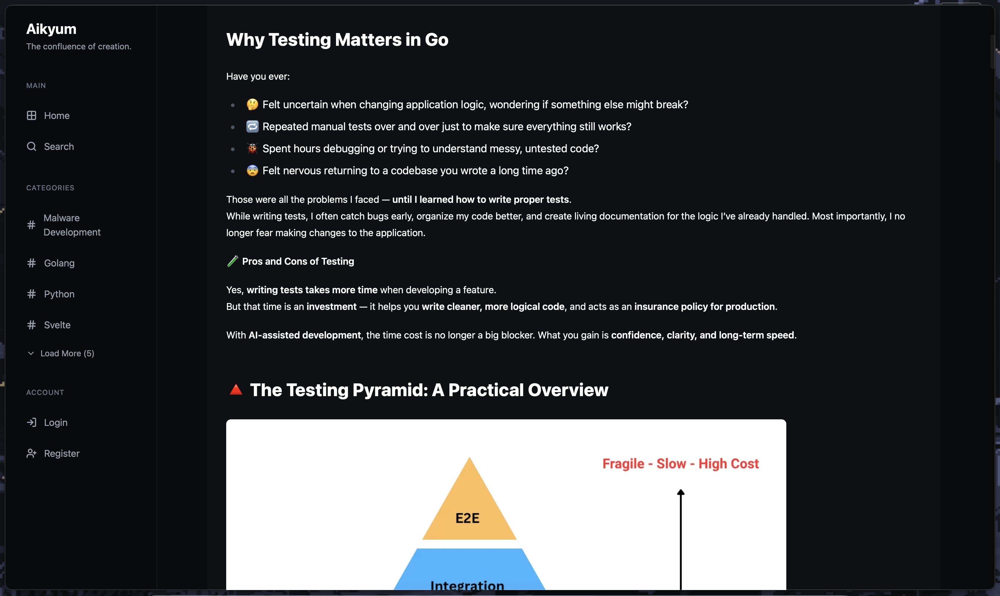
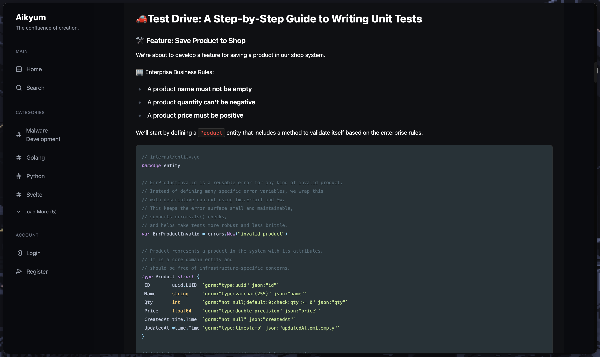
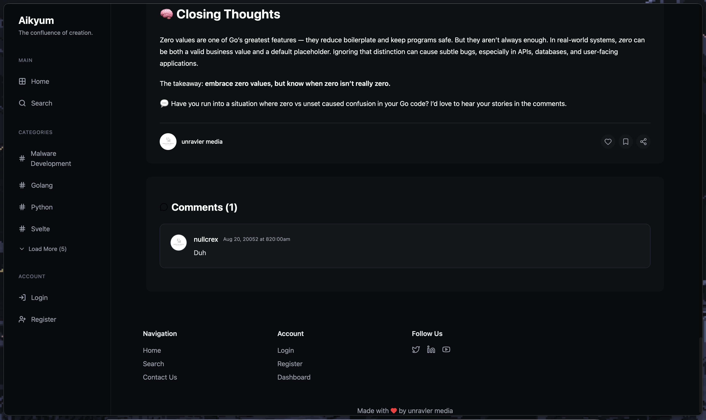

##### Blog Auth Page
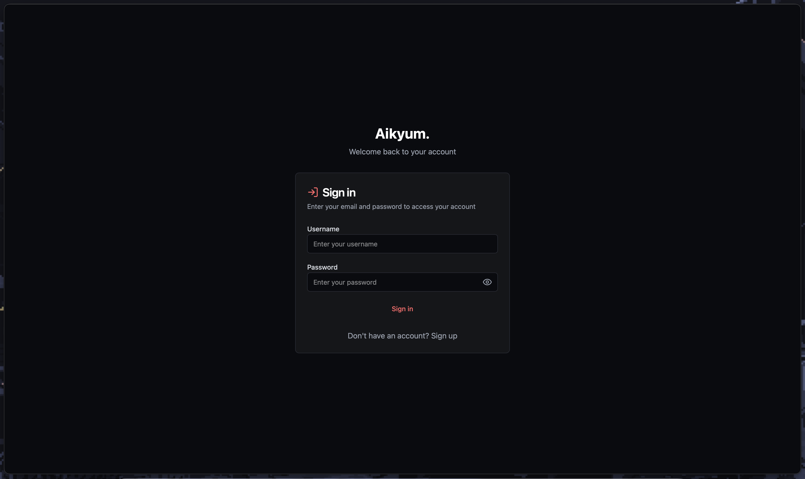
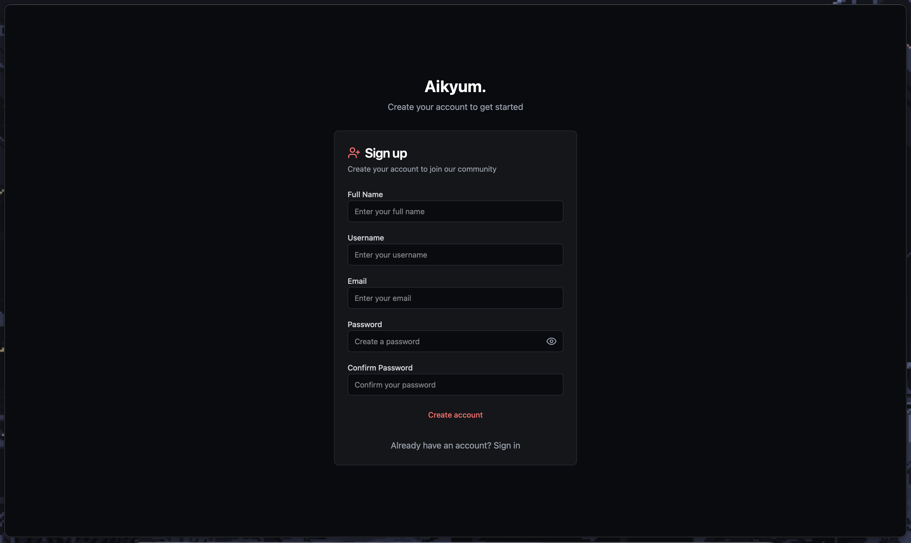

##### Blog Creator Page
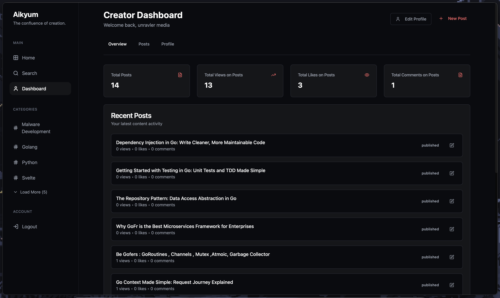
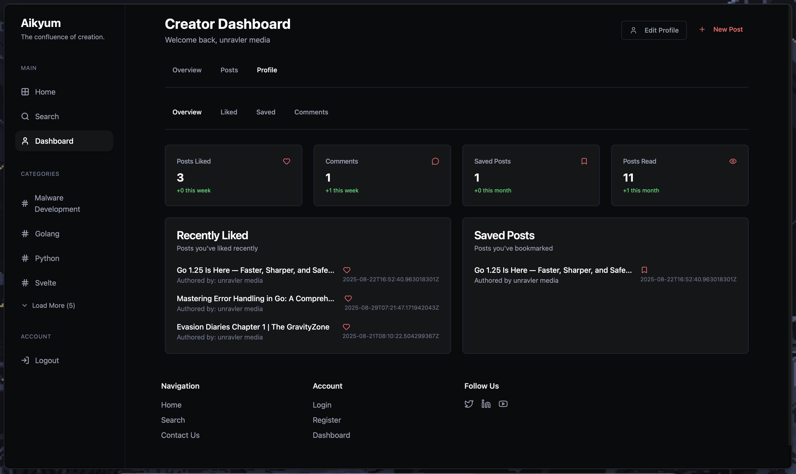
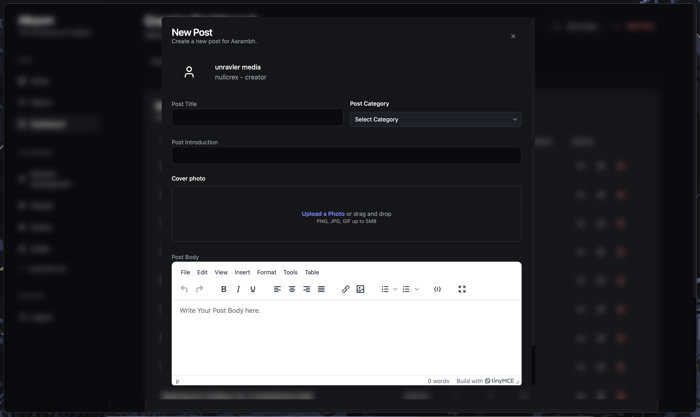
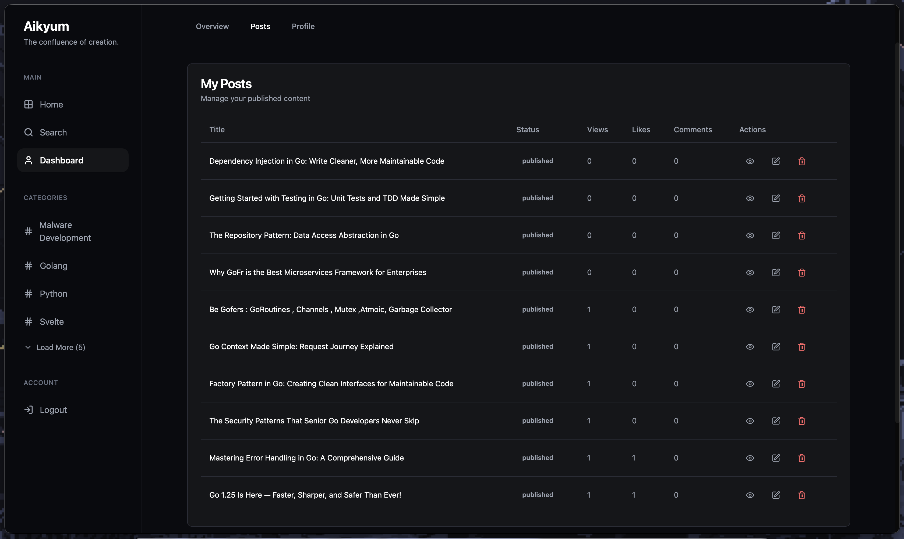
---

## 🚀 Tech Stack

Aikyum is a full-stack application built with a modern, performance-oriented technology stack.

| Area      | Technology                                                                                                  |
| :-------- | :---------------------------------------------------------------------------------------------------------- |
| **Frontend**  | **Astro**, **React**, **TypeScript**, **Tailwind CSS**, ShadCN-UI                                           |
| **Backend**   | **Go (GoFiber)**, **GORM**, **LibSQL (Turso)** for the database, and **Redis (Upstash)** for caching.       |
| **Deployment**| **Vercel** for the frontend and **Google Cloud Run** for the backend, managed via Docker.                 |

---

## 🏗️ Project Structure

The repository is organized into two main parts: a `backend` service and a `frontend` application.
```
├── backend/
│   ├── databases/ # Turso DB connector
│   ├── helpers/ # Utility functions (e.g., read time, GORM hooks)
│   ├── logic/ # Core business logic for API endpoints
│   ├── middlewares/ # Custom middleware (JWT auth, caching)
│   ├── models/ # GORM data models and hooks
│   ├── routes/ # API route definitions
│   ├── Dockerfile # Container definition for deployment
│   └── main.go # Application entry point
│
└── frontend/
├── public/         # Static assets
├── src/
│   ├── components/ # Reusable React & Astro components
│   ├── context/ # Global state management (AuthContext)
│   ├── hooks/ # Custom React hooks for data fetching
│   ├── layouts/ # Base Astro layouts
│   ├── pages/ # Application pages (Astro routes)
│   └── config/ # API configuration
└── astro.config.mjs # Astro configuration file
```

---

## 🌊 Request & Response Flow

Here’s a step-by-step breakdown of how a typical request flows through the Aarambh system, from the user's browser to the database and back.

**Example Flow: Fetching a Blog Post**

1.  **Client-Side (Browser)**
    *   A user navigates to a post URL, like `/posts/my-awesome-post`.
    *   Astro renders the page, which mounts the `PostDetail` React component (`src/pages/posts/[slug].astro`).
    *   The `PostDetail` component calls the `usePost(slug)` custom hook.

2.  **Frontend Logic (React & Hooks)**
    *   The `usePost` hook (`src/hooks/usePost.tsx`) constructs the API request URL (e.g., `https://<backend-url>/api/posts/get?post=my-awesome-post`) using configuration from `src/config/config.ts`.
    *   It sends an HTTP `GET` request to the backend. While waiting, it displays a loading skeleton (`PostSkeleton.tsx`).

3.  **Backend Middleware (GoFiber)**
    *   The request first hits the **Redis Caching Middleware** (`backend/middlewares/cacheHandler.go`). If a cached version of this post exists, it's returned immediately, and the flow stops here.
    *   If not cached, the request proceeds. It passes through CORS middleware. Since this is a public `GET` route, the JWT `Protect()` middleware is skipped.

4.  **Backend Routing & Logic (GoFiber)**
    *   The GoFiber router (`backend/routes/routes.go` and `backend/routes/posts.go`) matches the `/api/posts/get/` path to the `FetchPost` function in `backend/logic/posts.go`.
    *   The `FetchPost` function is executed. It retrieves the database instance injected by the `InjectDatabase` middleware.

5.  **Database Interaction (GORM & Turso)**
    *   The logic layer uses GORM to query the Turso database. It fetches the post by its `slug` and preloads related data like `Author`, `Category`, and `Comments` along with the comments' authors.
    *   `db.Preload("Author").Preload("Category")...Where("slug = ?", post_slug).First(&post)`

6.  **Backend Response Generation**
    *   The `FetchPost` function structures the retrieved data into a predefined JSON response format.
    *   This JSON object is sent back to the frontend with a `200 OK` status.
    *   The response is then captured by the caching middleware and stored in Redis for subsequent requests.

7.  **Frontend Rendering (React)**
    *   The `usePost` hook receives the JSON data, updates its state, and sets `loading` to `false`.
    *   React detects the state change and re-renders the `PostDetail` component and its children (`PostHeader`, `PostContent`, `CommentSection`) with the fetched data, displaying the complete article to the user.

---

## ✨ Key Features

*   **User Authentication**: Secure user registration and login system using JWT for stateless authentication.
*   **Role-Based Access Control**: Differentiated dashboards and capabilities for Admins, Creators, and Members.
*   **Full CRUD Functionality**: Comprehensive management of posts, categories, and comments.
*   **Content Interaction**: Users can like, save, and view posts, with interactions tracked in the database.
*   **Dynamic Search**: A responsive search feature to quickly find articles.
*   **Performant Caching**: A robust Redis-based caching layer for `GET` requests, with automatic cache invalidation on `CUD` (Create, Update, Delete) operations using GORM hooks.
*   **Modern Frontend**: A fast, responsive, and interactive UI built with Astro and React, styled with Tailwind CSS.

---

## 🔐 API Endpoints

The backend exposes a RESTful API for all content and user management operations.

### Authentication (`/api/auth`)

| Method | Endpoint              | Protected | Description                          |
| :----- | :-------------------- | :-------- | :----------------------------------- |
| `POST` | `/login/`             | No        | Authenticates a user and returns a JWT.|
| `POST` | `/register/`          | No        | Creates a new user account.          |

### Categories (`/api/category`)

| Method   | Endpoint              | Protected | Description                               |
| :------- | :-------------------- | :-------- | :---------------------------------------- |
| `GET`    | `/`                   | No        | Fetches a list of all categories.         |
| `GET`    | `/get?slug=<slug>`    | No        | Fetches a single category by its slug.    |
| `POST`   | `/create/`            | Yes       | Creates a new category.                   |
| `PUT`    | `/edit/`              | Yes       | Updates an existing category.             |
| `DELETE` | `/delete/`            | Yes       | Deletes a category.                       |

### Posts (`/api/posts`)

| Method   | Endpoint              | Protected | Description                               |
| :------- | :-------------------- | :-------- | :---------------------------------------- |
| `GET`    | `/`                   | No        | Fetches a list of all posts.              |
| `GET`    | `/get?post=<slug>`    | No        | Fetches a single post by its slug.        |
| `POST`   | `/create/`            | Yes       | Creates a new post.                       |
| `PUT`    | `/update/`            | Yes       | Updates an existing post.                 |
| `DELETE` | `/delete/`            | Yes       | Deletes a post.                           |
| `POST`   | `/like/:slug`         | Yes       | Likes a post.                             |
| `POST`   | `/read/:slug`         | Yes       | Marks a post as read by the user.         |
| `POST`   | `/save/:slug`         | Yes       | Saves a post for the user.                |

### Comments (`/api/comment`)

| Method   | Endpoint              | Protected | Description                               |
| :------- | :-------------------- | :-------- | :---------------------------------------- |
| `POST`   | `/create/`            | Yes       | Adds a comment to a post.                 |
| `PUT`    | `/edit/`              | Yes       | Edits an existing comment.                |
| `DELETE` | `/delete/`            | Yes       | Deletes a comment.                        |

### Search (`/api/query`)

| Method | Endpoint          | Protected | Description                               |
| :----- | :---------------- | :-------- | :---------------------------------------- |
| `GET`    | `/query?q=<term>` | No        | Searches for posts matching the query term.|

---

## ⚙️ Getting Started

To get a local copy up and running, follow these simple steps.

### Prerequisites

*   **Go**: Version 1.22 or higher.
*   **Node.js**: Version 18 or higher.
*   **pnpm** (recommended): `npm install -g pnpm`.
*   Access to **Turso** for a database URL and an auth token.
*   Access to **Upstash** for a Redis URL.

### Installation & Setup

1.  **Clone the repository:**
    ```sh
    git clone https://github.com/unravler-media/aikyum-public.git
    cd aarambh
    ```

2.  **Set up the Backend:**
    *   Navigate to the backend directory: `cd backend`
    *   Create a `.env` file and add your environment variables. You can use the `Dockerfile` as a reference:
        ```env
        turso_api="libsql://your-turso-db-url?authToken=your-turso-token"
        secretKey="your-jwt-secret-key"
        REDIS_URL="your-upstash-redis-url"
        ```
    *   Install Go dependencies:
        ```sh
        go mod tidy
        ```
    *   Run the backend server:
        ```sh
        go run main.go
        ```
    *   The server will start on `http://localhost:8000`.

3.  **Set up the Frontend:**
    *   Navigate to the frontend directory: `cd ../frontend`
    *   Install npm packages using pnpm:
        ```sh
        pnpm install
        ```
    *   Run the development server:
        ```sh
        pnpm dev
        ```    *   The frontend will be available at `http://localhost:4321`.

---

## ☁️ Deployment

The project is configured for seamless deployment to modern cloud platforms.

### Backend

The backend is containerized using **Docker** and set up for continuous deployment on **Google Cloud Run**. The deployment pipeline is defined in `backend/cloudbuild.yaml` and is triggered by pushes to the main branch. It automatically builds the Docker image, pushes it to Google Container Registry (GCR), and deploys the new version to Cloud Run.

### Frontend

The frontend is built with **Astro** and configured for **Vercel's** serverless platform. The deployment configuration is handled by the `@astrojs/vercel` adapter in `astro.config.mjs`. To deploy, simply connect your GitHub repository to a Vercel project, and any push to the production branch will trigger an automatic build and deployment.

---

## 🤝 Contributing

Contributions are what make the open-source community such an amazing place to learn, inspire, and create. Any contributions you make are **greatly appreciated**.

If you have a suggestion that would make this better, please fork the repo and create a pull request. You can also simply open an issue with the tag "enhancement".

1.  Fork the Project
2.  Create your Feature Branch (`git checkout -b feature/AmazingFeature`)
3.  Commit your Changes (`git commit -m 'Add some AmazingFeature'`)
4.  Push to the Branch (`git push origin feature/AmazingFeature`)
5.  Open a Pull Request

---

## 📜 License

Distributed under the MIT License. See `LICENSE.md` for more information.
